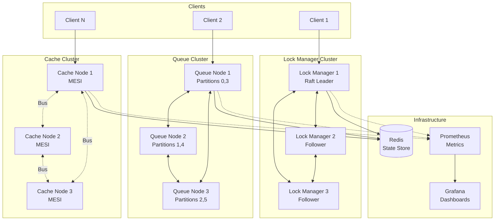
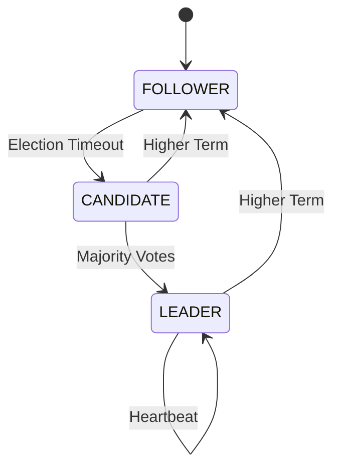
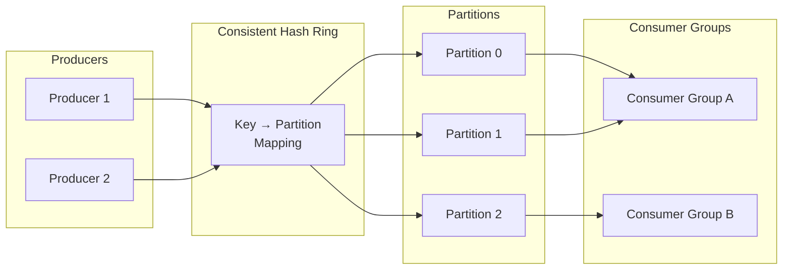
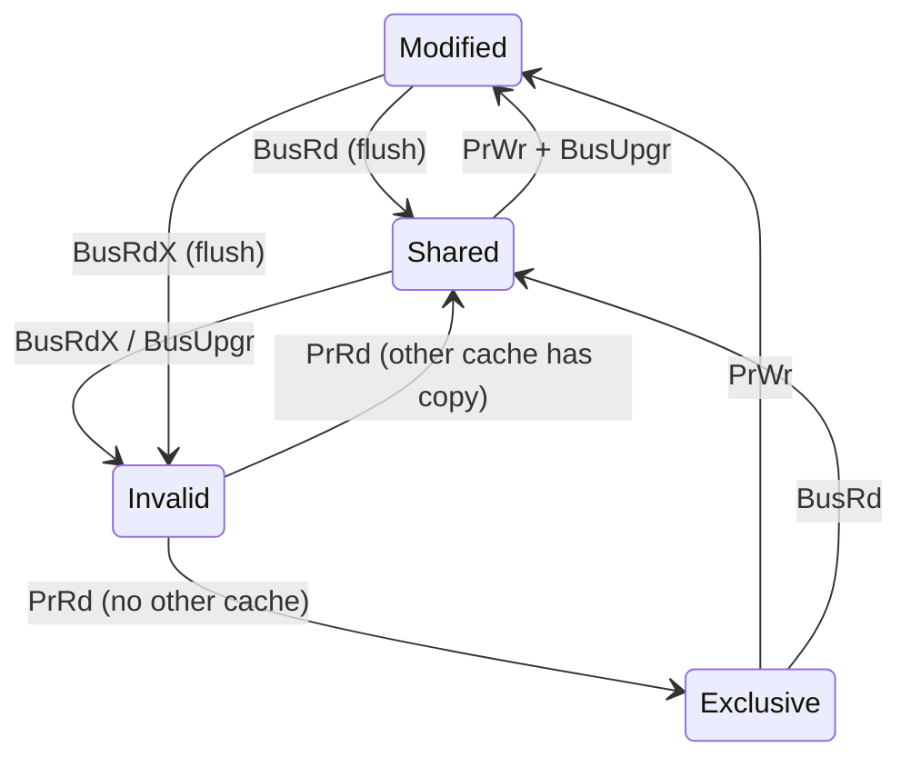
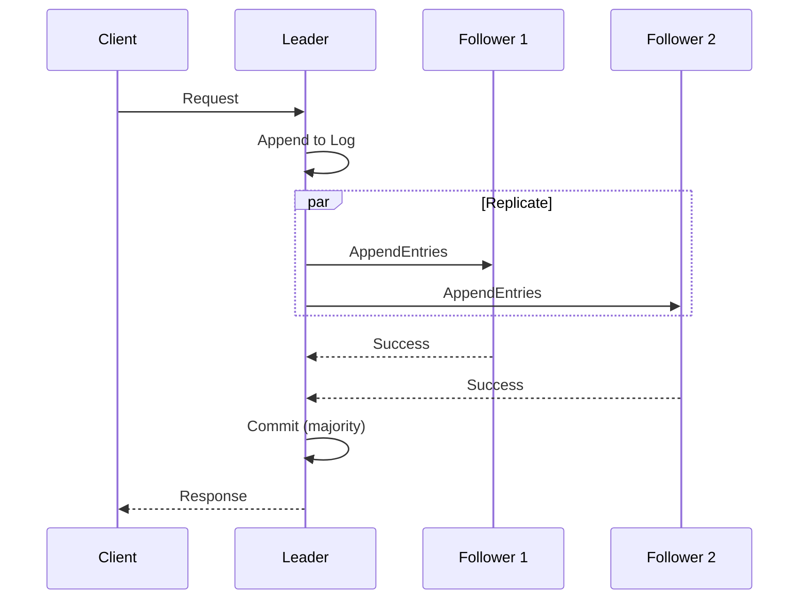
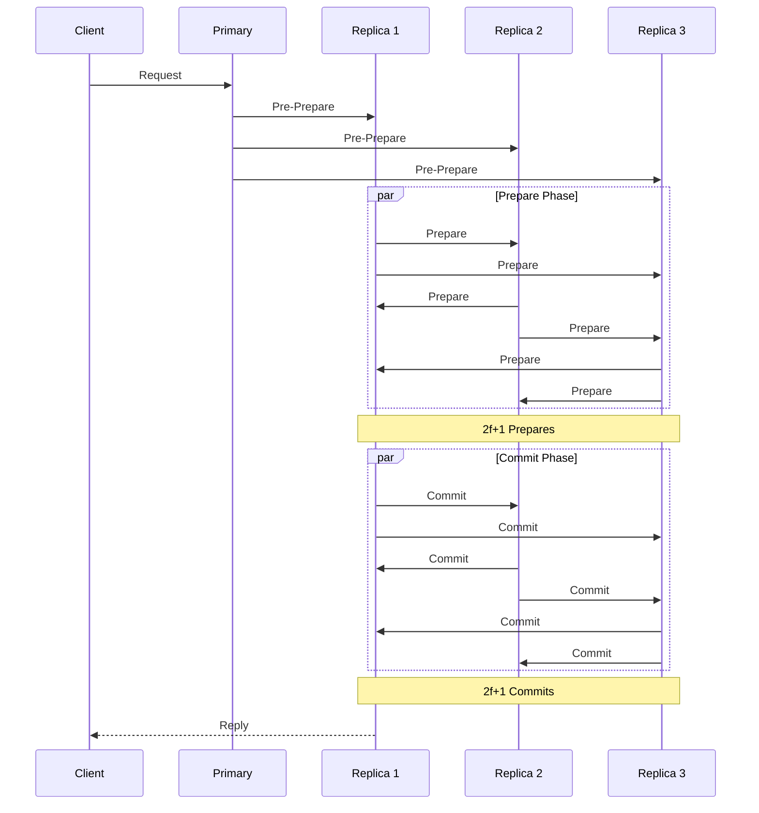
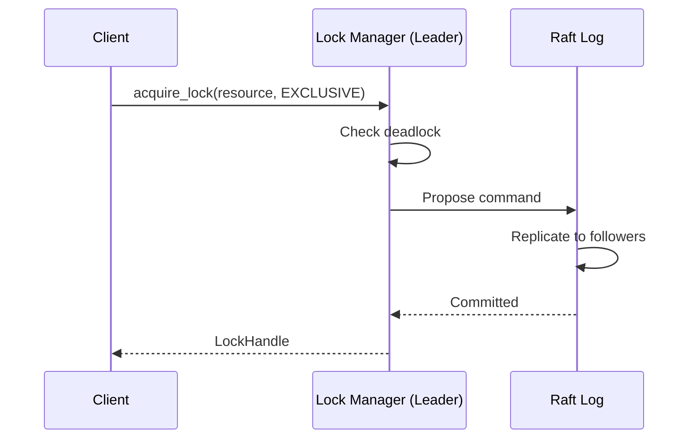
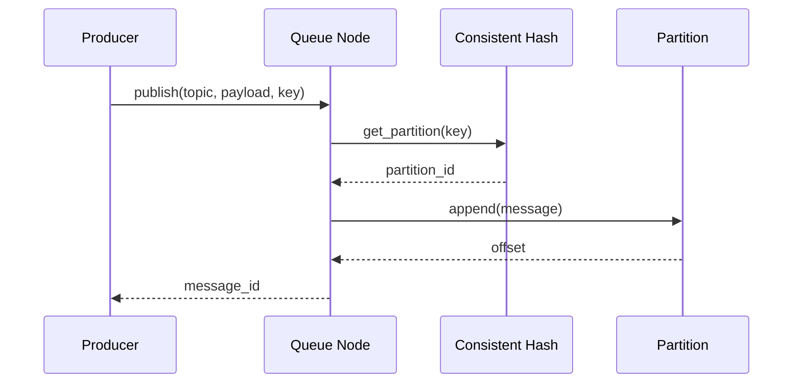

# Arsitektur Synaxis

## Gambaran Umum Sistem

Synaxis adalah sistem sinkronisasi terdistribusi yang mengimplementasikan tiga komponen utama: Distributed Lock Manager, Distributed Queue, dan Distributed Cache dengan protokol MESI coherence.



---

## Arsitektur Komponen

### 1. Distributed Lock Manager



**Fitur Utama:**
- **Raft Consensus**: Leader election, log replication
- **Tipe Lock**: Shared (read) dan Exclusive (write)
- **Deadlock Detection**: Analisis wait-for graph
- **Fencing Tokens**: Mencegah stale locks

### 2. Distributed Queue



**Fitur Utama:**
- **Consistent Hashing**: Distribusi merata dengan virtual nodes
- **At-Least-Once Delivery**: Acknowledgment dengan retry
- **Consumer Groups**: Partition assignment dan rebalancing
- **Dead Letter Queue**: Penanganan pesan gagal

### 3. Cache Coherence (MESI)



**Bus Transactions:**
| Transaction | Deskripsi |
|------------|-----------|
| BusRd | Read request, shared access |
| BusRdX | Read dengan intent to modify |
| BusUpgr | Upgrade shared ke exclusive |
| Flush | Write back modified data |

---

## Algoritma Consensus

### Raft (Default)



### PBFT (Opsional)



**Toggle via environment:**
```env
CONSENSUS_TYPE=raft   # Default
CONSENSUS_TYPE=pbft   # Byzantine fault tolerant
```

---

## Alur Data

### Lock Acquisition



### Message Publishing



---

## Struktur Direktori

```
src/
├── nodes/
│   ├── base_node.py      # Abstract base dengan MessageBus, FailureDetector
│   ├── lock_manager.py   # Raft + Lock management
│   ├── queue_node.py     # Consistent hashing + Partitions
│   └── cache_node.py     # Protokol MESI + LRU
├── consensus/
│   ├── raft.py           # Leader election, log replication
│   └── pbft.py           # Byzantine fault tolerance
├── communication/
│   ├── message_passing.py # ormsgpack + aiohttp transport
│   └── failure_detector.py # Heartbeat-based detection
└── utils/
    ├── config.py         # Environment configuration
    ├── metrics.py        # Prometheus metrics
    └── consistent_hash.py # Virtual nodes hashing
```

---

## Technology Stack

| Komponen | Teknologi |
|----------|-----------|
| Bahasa | Python 3.12+ |
| Async | asyncio, aiohttp |
| Serialization | ormsgpack (binary), orjson (JSON) |
| State Store | Redis |
| Metrics | Prometheus + Grafana |
| Container | Docker, Docker Compose |
